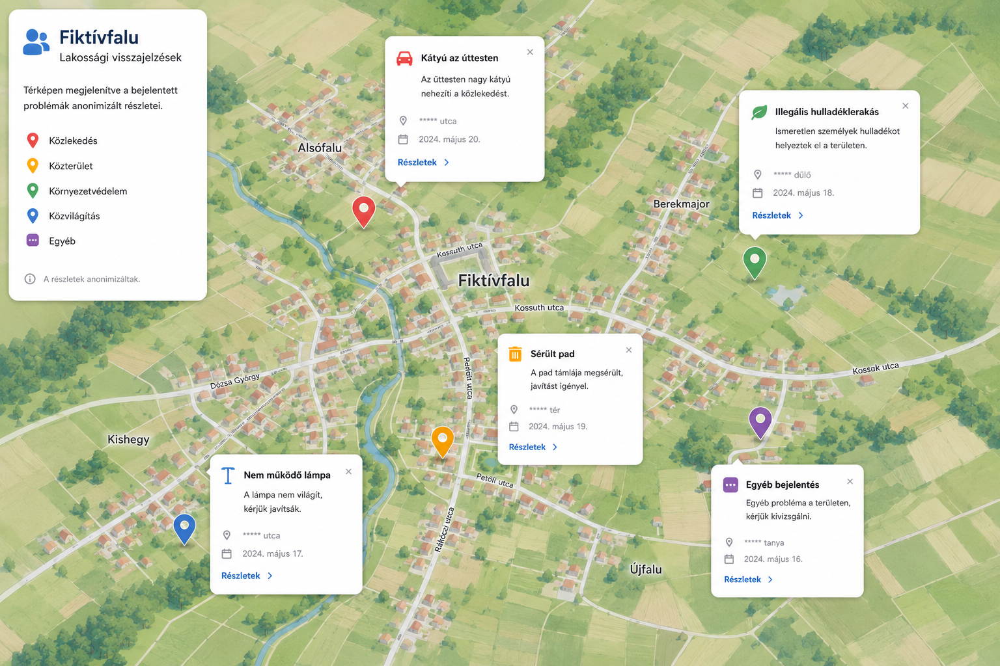

# Fiktívfalu – Lakossági Helyzettérkép Alkalmazás

A **Fiktívfalu Helyzettérkép** egy interaktív, térképalapú közösségi platform, amely lehetővé teszi a település lakói számára a helyi problémák jelzését, a pozitív értékek gyűjtését, valamint a közügyek átlátható követését. Az alkalmazás elsődleges célja a lakossági visszajelzések hatékony, moderált publikálása és a helyi közösségek támogatása.

## Rendszerarchitektúra és Kategóriák

Az alkalmazás a lakossági jelzéseket és bejelentéseket 6 fő strukturált halmazba sorolja a komplex helyzetelemzés érdekében:

1. **Jó példák és értékek**
   * Működő közösségi kezdeményezések és terek
   * Szép építészeti és környezeti felújítások
   * Helyi termelők és segítőkész lakosok ("jó arcok, akiktől segítséget kérhetsz")
   * Példaértékű önkormányzati döntések, programok és természeti értékek

2. **Fejlesztési lehetőségek**
   * Útállapotok, úthibák és kátyúk bejelentése
   * Hiányzó gyalogos-átkelőhelyek (zebrák) és közlekedési kérdések
   * Játszótér-igények és közösségi terek hiányának jelzése

3. **Környezet és táj**
   * Fakivágások és illegális szemétlerakások nyomon követése
   * Vízfolyások állapota, természetes élőhelyek megőrzése
   * Inváziós fajok jelenlétének jelentése

4. **Közösségi biztonság**
   * Közlekedési veszélypontok és balesetveszélyes helyek
   * Kóbor állatok helyzetének kezelése és jelzése

5. **Szociális és emberi ügyek**
   * Idősek helyzete és támogatása
   * Családtámogatási és lakhatási kérdések
   * Közvetlen lakossági segítségkérés (szolidaritási modul)

6. **Helyi közügyek és átláthatóság**
   * Képviselő-testületi ülések és lakossági fórumok nyomon követése
   * Közérdekű adatigénylések, pályázatok és önkormányzati beruházások transzparenciája

---

## Interaktív Térképfelület és Működés

A felhasználók geolokáció (pontos helyszín, pl. *utca, dűlő, tanya*) és időpont alapján rögzíthetik a bejelentéseket az interaktív térképen. A rendszer az alábbi vizuális színkódokat és kategóriákat használja:

* **Közlekedés:** pl. *„Kátyú az úttesten – Az úttesten nagy kátyú nehezíti a közlekedést.”*
* **Közterület:** pl. *„Sérült pad – A pad támlája megsérült, javítást igényel.”*
* **Környezetvédelem:** pl. *„Illegális hulladéklerakás – Ismeretlen személyek hulladékot helyeztek el a területen.”*
* **Közvilágítás:** pl. *„Nem működő lámpa – A lámpa nem világít, kérjük javítását.”*
* **Egyéb / Egyedi bejelentés:** pl. *„Egyéb bejelentés – Egyéb probléma a területen, kérjük kivizsgálni.”*

---

## Biztonság és Adatkezelés

* **Anonimizált részletek:** A lakossági biztonság érdekében a térképen megjelenített bejelentések részletei teljesen anonimizáltak (pl. a pontos házszámok helyett `***** utca` vagy `***** tanya` formátumban jelennek meg).
* **Moderált munkafolyamat:** A beküldött jelzések egy belső moderációs folyamaton mennek keresztül. Csak a jóváhagyott, konstruktív bejelentések kerülnek publikálásra a felületen.
